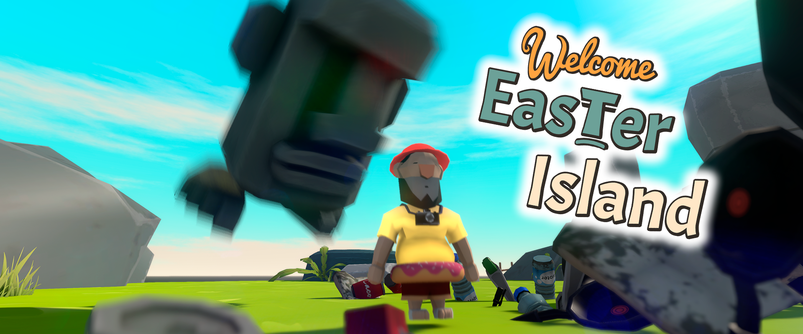

  

# Welcome Easter Island

Easter Island is in danger! 

Due to human pollution, the island is almost completely submerged.
You are the last Moai, eradicate all the tourists to clean the island and lower the sea level!

Welcome Easter Island is a Unity game created during a school game jam that lasted 3 days, with the goal of creating a full game in collaboration with students from every branch of the school.

--

I mostly worked on the player character and various bugfixes and assets integrations  

[Itch.io link](https://daviddian.itch.io/welcome-easter-island) to try the full release, with small fixes and improvements over this version  
